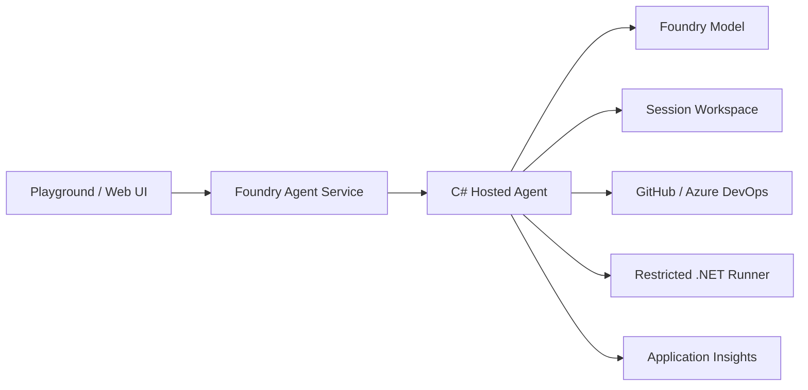

# C# Coding Agent for GitHub and Azure DevOps

## 1. Purpose

This repository contains a production-oriented coding agent implemented in C# and intended for deployment to Microsoft Foundry Agent Service as a Hosted Agent. The agent accepts natural-language engineering tasks, opens a GitHub or Azure DevOps repository, changes C# code, adds tests, runs restore/build/test, and presents the resulting diff and validation report for review. With explicit human tool approval, it can publish an `agent/*` branch and create a pull request.

## 2. User Experience

During development, users chat with the agent through the local Agent Inspector. After deployment, users use the Foundry Agent Playground or a custom application that calls the OpenAI-compatible Responses endpoint.

A typical request is:

> Open https://github.com/contoso/orders-api at main. Add an optional cancellation reason to the cancel endpoint, add xUnit tests, and run the Release build. Do not push.

The agent returns the files changed, unified diff, restore/build/test results, and any remaining risks. When the user requests a pull request, the framework returns an approval request containing the proposed tool arguments. No commit or remote write occurs until the caller approves it.

## 3. Architecture



The Hosted Agent owns orchestration and model interaction. Each Foundry session runs in a VM-isolated sandbox and has persistent `$HOME` storage. Repository code is stored below `$HOME/workspaces/current`. The production design moves untrusted builds into a separate ephemeral runner; the MVP runs only allow-listed `git` and `dotnet` commands in the Hosted Agent sandbox.

## 4. Technology Choices

| Area | Choice |
|---|---|
| Runtime | .NET 10 |
| Agent framework | Microsoft Agent Framework |
| Hosting | Microsoft Foundry Hosted Agent |
| Protocol | Responses 2.0 |
| Model access | `Azure.AI.Projects` |
| Authentication | `Azure.Identity` and managed identity |
| Unit tests | xUnit v3 |
| Deployment | Azure Developer CLI and Bicep |
| Telemetry | OpenTelemetry and Application Insights |

## 5. Components

### CodingAgent.Host

Hosts the Responses endpoint, creates the Foundry-backed `AIAgent`, and registers local function tools. Foundry injects the project endpoint, managed identity, session persistence, and Application Insights configuration.

### CodingAgent.Core

Contains provider-neutral repository models and contracts. Repository URLs are normalized into either GitHub or Azure DevOps references before any network operation.

### CodingAgent.Repositories

Recognizes GitHub and Azure DevOps URL formats and uses a parameterized Git process to clone and push the Agent's local workspace. Credentials are injected from Foundry project connections into child-process environment variables; they are never embedded in clone URLs, command arguments, logs, or Git configuration files. Remote collaboration operations such as pull-request creation are supplied by GitHub and Azure DevOps MCP tools through a Foundry Toolbox.

### CodingAgent.Tools

Exposes narrowly scoped agent tools for repository initialization, file listing, file reading, text search, file writing, Git diff/status, branch creation, .NET validation, and approval-gated publication of an `agent/*` branch.

### CodingAgent.Security

Constrains every path to the session workspace and every process to an executable allow list. Commands do not pass through a shell. Output and execution time are bounded.

## 6. Agent Workflow

```text
INTAKE -> OPEN_REPOSITORY -> INSPECT -> PLAN -> MODIFY
    -> VALIDATE -> REPAIR (bounded) -> REVIEW_DIFF
    -> HUMAN_APPROVAL -> COMMIT -> PUSH_AGENT_BRANCH
    -> TOOLBOX_MCP_APPROVAL -> CREATE_PR
```

The system instructions require the agent to inspect before editing, keep changes focused, add or update tests, validate the narrowest relevant scope, and report failures honestly. A repair loop is limited to avoid uncontrolled token and compute consumption.

## 7. Repository Providers

The system supports these canonical URL families:

- GitHub: `https://github.com/{owner}/{repository}`
- Azure DevOps: `https://dev.azure.com/{organization}/{project}/_git/{repository}`
- Azure DevOps legacy: `https://{organization}.visualstudio.com/{project}/_git/{repository}`

Both providers implement the same `IRepositoryProvider` contract for local workspace synchronization. GitHub authentication uses `GITHUB_TOKEN`, supplied through a Foundry connection; short-lived GitHub App installation tokens are preferred. Azure DevOps authentication uses `AZURE_DEVOPS_TOKEN`, with Basic authentication for PATs or Bearer authentication for Entra tokens. The Foundry Toolbox separately authenticates its remote MCP tools, typically with OAuth identity passthrough.

Remote MCP servers cannot access the Hosted Agent's local filesystem. Azure DevOps MCP exposes repository reads, branch creation, and pull-request operations, but it doesn't expose file-write or commit tools. Consequently MCP can't replace local Git clone/push while preserving full-repository builds and tests across both providers.

## 8. C# Project Support

The first release supports `.sln`, `.slnx`, and `.csproj` entry points, including ASP.NET Core, workers, console applications, libraries, xUnit, NUnit, MSTest, central package management, and `global.json` SDK selection.

The default validation sequence is:

```text
dotnet restore <target>
dotnet build <target> --no-restore --configuration Release
dotnet test <target> --no-build --configuration Release --logger trx
```

## 9. Security Model

- All repository content and tool output is untrusted input.
- File paths are resolved and checked against the workspace root.
- Symbolic-link and path traversal escapes are rejected.
- Processes are started directly with argument lists, never through a shell.
- Only `git` and `dotnet` are allowed in the MVP.
- Force push, protected-branch mutation, credential output, and access outside the workspace are forbidden.
- Local branch publication is wrapped in `ApprovalRequiredAIFunction`; the model can propose it but commit and push cannot execute before the caller approves it.
- Toolbox write tools must be configured with `require_approval: always`, and the Hosted Agent runtime must preserve that approval requirement.
- The only allowed push refspec is the current `HEAD` to `refs/heads/agent/*`; direct pushes to `main`, force pushes, malformed refs, and arbitrary remotes are rejected.
- Branch publication reruns restore, Release build, and tests before staging or committing changes.
- Secrets belong in managed connections or Key Vault, never images, prompts, logs, or repository configuration.

## 10. Deployment

The agent is packaged as a .NET 10 Hosted Agent with the Responses 2.0 protocol. `azure.yaml` describes its Foundry model dependency, runtime, entry point, and compute allocation. The deployment context is the repository root so all referenced projects are included. The final container intentionally uses the .NET SDK image, rather than the smaller ASP.NET runtime image, because the agent must build target repositories. The container image is also locally buildable for parity testing.

Production should use Standard Setup with a VNet, private storage and registry endpoints, restricted egress, managed identity RBAC, and a separate build runner that has no Foundry identity or repository write credential.

## 11. Testing

Unit tests cover URL recognition, path confinement, command policy, and workspace behavior. Integration tests use fixture repositories to verify the complete edit/build/test loop. Deployment validation must include a local Responses smoke test, a remote Foundry invocation, and an evaluation suite covering successful changes, compile failures, test failures, malicious repository instructions, and path traversal attempts.

## 12. Delivery Phases

1. Hosted C# Agent, function tools, local workspace, GitHub/ADO clone and push, .NET validation, and approval-gated Toolbox pull requests.
2. Automated GitHub App token issuance and Azure DevOps OBO authentication.
3. Isolated ephemeral build runner, artifact storage, cancellation, and durable checkpoints.
4. Web workbench with chat, diff, logs, Approve Push, and Create Pull Request actions.
5. VNet hardening, evaluation gates, monitoring, quotas, and production rollout.

## 13. MVP Acceptance Criteria

The deployed agent can open a GitHub or Azure DevOps C# repository, inspect and modify files under its session workspace, add tests, execute bounded `dotnet` validation, and return a diff and results. With a configured provider connection and explicit human approval, it can commit and push only an `agent/*` branch and create a pull request against the originally opened branch.